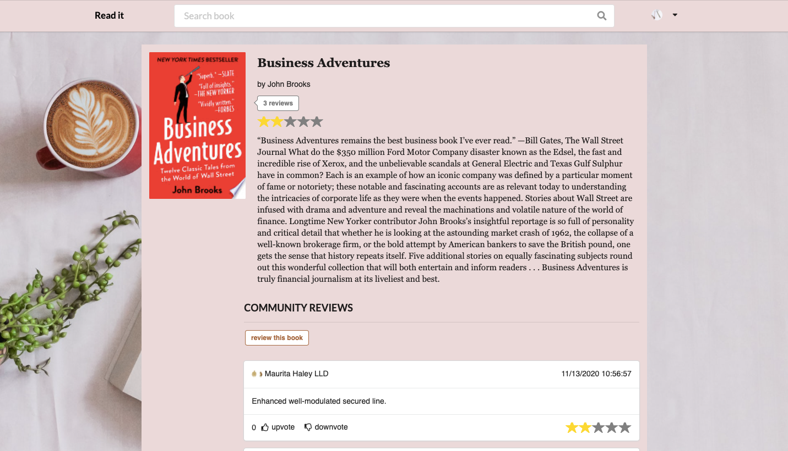
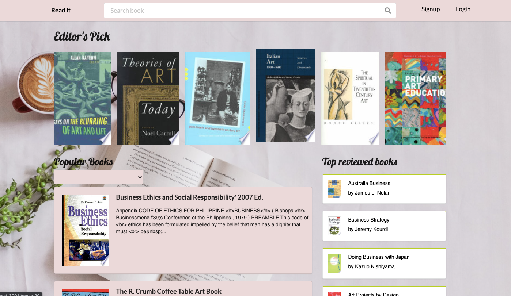
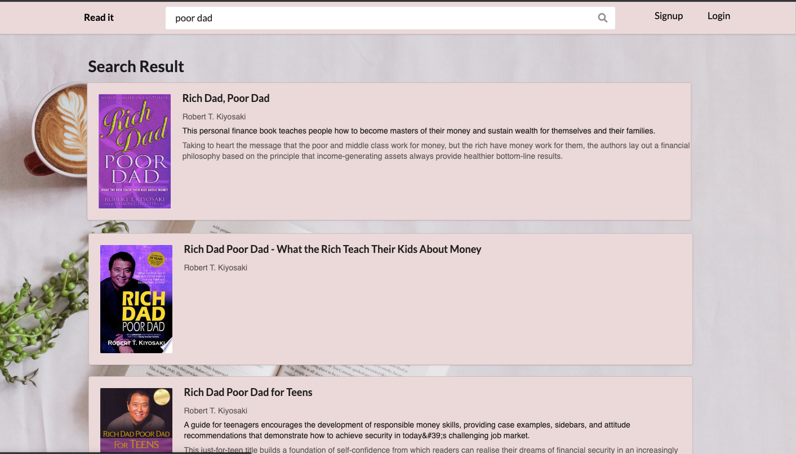
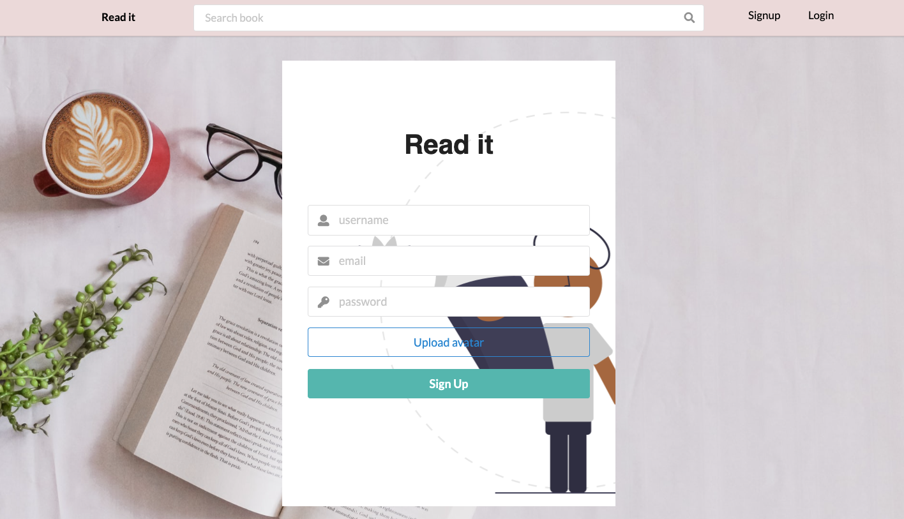
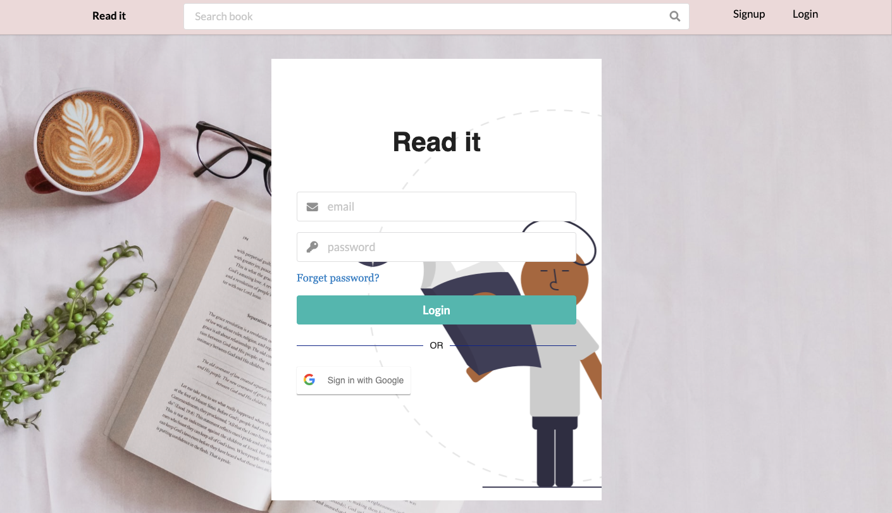
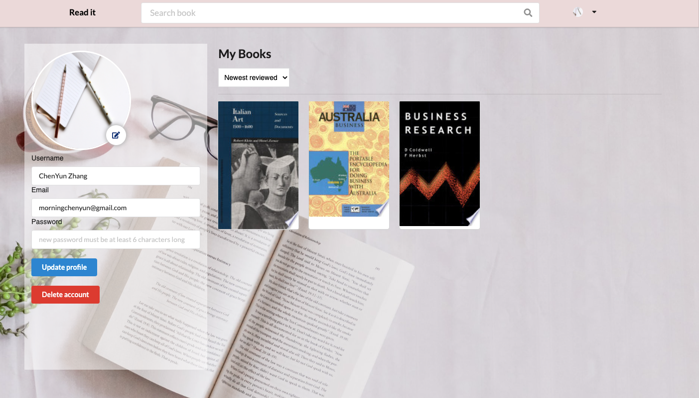
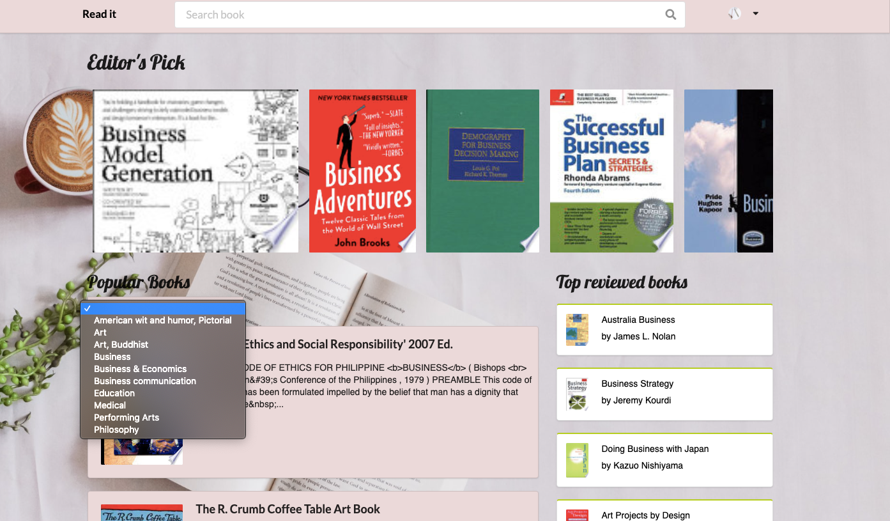

<h1>Readit</h1>

## Table of Content
<ul>
  <li><a href="#About">About</a></li>
  <li><a href="#Features">Features</a></li>
  <li><a href="#Stacks">Stacks</a></li>
</ul>

## About

 
<em>Read It</em> is designed for readers to shared their thought on the books they've or find out how other readers think about the book. Users can read the book description without login. Users can easily log in with their google account to review the books or vote for other readers' reviews. Read It also enabled the "forgot password" feature for users to retrieve their accounts back.

     
     
  
     
  
      
     

## Features
  <ul>
      <li>Used redux to store data globally and for easy retrieval of data to any component in the app. </li>
      <li>Maximized use of Events and promises in ES6 and React for application control flow.</li>
      <li>Used React Router, and react hook, such as useEffect, useState  to create functional components.</li>
      <li>Integrated Google book API and Google OAuth 2.0.</li>
      <li>Connected Rails ActiveStorage with Cloudinary to upload static files to the cloud. </li>
      <li>Optimized the Rails ActionMailer -- users receive an auto-generated template-based email to reset the password.</li>
  </ul>
  

## Stacks
  <ul>
    <li>JavaScript</li>
    <li>React.js</li>
    <li>Redux.js</li>
    <li>Ruby on Rails API</li>
    <li>Semantic UI</li>
    <li>Google Book Api</li>
    <li>Google OAuth</li>
  </ul>
  
